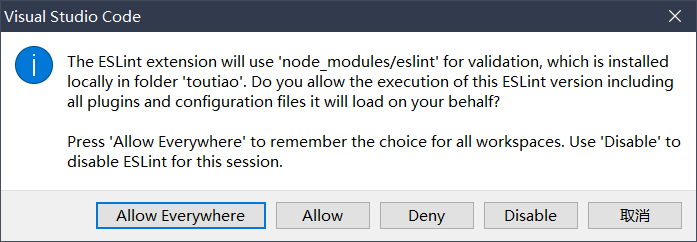

# 1.初始化项目

## 1.1 创建并梳理项目的结构

1. 运行如下的命令，基于vue-cli创建Vue2的工程化项目:

```bash
  vue create hei-ma-tou-tiao
```

2. 重置 App.vue 根组件中的代码如下：

```js
<template>
  <div>App 根组件</div>
</template>

<script>
  export default {
    name: 'App'
  }
</script>

<style lang="less" scoped></style>
```

3. 清空 /src/router/index.js 路由模块，删除创建项目时自带的路由规则：

```js
import Vue from 'vue'
import VueRouter from 'vue-router'

Vue.use(VueRouter)

// 清空路由规则
const routes = []

const router = new VueRouter({
  routes
})

export default router
```

4. 删除 components 目录下的 HelloWorld.vue 组件

5. 删除 views 目录下的 About.vue 和 Home.vue 组件

6. 执行 npm run serve 命令，把项目运行起来看效果

## 1.2 了解ESLint常见的语法规则

ESLint 提供了许多校验代码格式的语法规则，常见的语法规则列表如下：

| 序号 | 规则名称                    | 规则约束\|默认约束                           |
| ---- | --------------------------- | -------------------------------------------- |
| 1    | quotes                      | 默认: 字符串需要使用单引号包裹               |
| 2    | key-spacing                 | 默认: 对象的属性和值之间，需要一个空格分隔   |
| 3    | comma-dangle                | 默认: 对象或数组的末尾，不允许出现多余的逗号 |
| 4    | no-multiple-empty-lines     | 不允许出现多个空行                           |
| 5    | no-trailing-spaces          | 不允许在行尾出现多余的空格                   |
| 6    | eol-last                    | 默认：文件的末尾必须保留一个空行             |
| 7    | spaced-comment              | 在注释中的`//`或`/*`后强制使用一致的间距     |
| 8    | indent                      | 强制一致的缩进                               |
| 9    | import/first                | `import` 导入模块的语句必须声明在文件的顶部  |
| 10   | space-before-function-paren | 方法的形参之前是否需要保留一个空格           |

::: tip
详细的 ESLint 语法规则列表，请参考[官方文档](https://eslint.org/docs/rules/)
:::

### 1.2.1 自定义ESLint的rules规则

如果希望修改 ESLint 默认的校验规则，可以在 .eslintrc.js 文件的 rules 节点下进行自定义。例如：

```js
  rules: {
    // 默认情况下，ESLint 规定：方法的形参之前必须保留一个空格
    // 'space-before-function-paren': ['error', 'always']

    // 如果指定了规则的值为 never，则不允许在方法的形参之前保留任何空格
    'space-before-function-paren': ['error', 'never']
  }
```

### 1.2.2 安装vscode的ESLint插件

::: tip
为了让开发者**专注于业务功能的开发**，推荐大家在 vscode 中安装并配置 ESLint 插件。
它可以在保存文件的时候，遵循 ESLint 的语法规则，自动对代码进行格式化。
:::

1. 在 vscode 中搜索并安装 ESLint 插件.

2. 打开 vscode 的 settings.json 配置文件，新增如下的配置节点:

```js
// ESLint 插件的配置
"editor.codeActionsOnSave": {
  "source.fixAll": true,
},
```

3. 点击 vscode 状态栏右下角的 ESLint 按钮，在弹出层中选择 Allow Everywhere。

   

## 1.3 配置vant组件库

::: tip
如果想要看详细的解释，请阅读[官方文档](https://vant-contrib.gitee.io/vant/#/zh-CN/)
:::

1. 运行如下的命令，在项目中安装 vant 组件库：

```bash
npm i vant@2.12.12 -S
```

2. 在 main.js 入口文件中，完整导入并注册所有的 vant 组件：

```js
import Vue from 'vue'

import Vant from 'vant'
import 'vant/lib/index.css'

Vue.use(Vant)
```

3. 在 App.vue 根组件中，基于 Button 按钮组件测试是否配置成功：

```js
<template>
  <div>
    <p>App 根组件</p>
    <van-button type="primary">主要按钮</van-button>
    <van-button type="info">信息按钮</van-button>
    <van-button type="default">默认按钮</van-button>
    <van-button type="warning">警告按钮</van-button>
    <van-button type="danger">危险按钮</van-button>
  </div>
</template>
```

4. 一次性、完整导入并注册所有 vant 组件的优缺点：
    - 优点：所有的 vant 组件都进行了全局的注册。在每个组件中，不再需要按需引入并注册组件了。
    - 缺点：项目中没有用到的组件也会被打包进来，导致打包体积过大的问题（此问题在项目发布时，可通过 CDN 加速解决）。

## 1.4 Vant组件库的rem布局适配

> 如果需要使用 `rem` 单位进行适配，推荐使用以下两个工具：
>
> - [postcss-pxtorem](https://github.com/cuth/postcss-pxtorem) 是一款 PostCSS 插件，用于将 px 单位转化为 rem 单位
> - [lib-flexible](https://github.com/amfe/lib-flexible) 用于动态设置 rem 基准值
>
> 详情请参考 Vant的[官方文档](https://vant-contrib.gitee.io/vant/#/zh-CN/advanced-usage#rem-bu-ju-gua-pei)

### 1.4.1 配置postcss-pxtorem

1. 运行如下的命令：

```bash
npm install postcss-pxtorem@5.1.1 -D
```

2. 在 vue 项目根目录下，创建 postcss 的配置文件 postcss.config.js，并初始化如下的配置：

```js
module.exports = {
  plugins: {
    'postcss-pxtorem': {
      rootValue: 37.5, // 根节点的 font-size 值
      propList: ['*'] // 要处理的属性列表，* 代表所有属性
    }
  }
}
```

3. 关于 px -> rem 的换算：

```bash
iphone6

375px = 10rem
37.5px = 1rem
1px = 1/37.5rem
12px = 12/37.5rem = 0.32rem
```

### 1.4.2 配置amfe-flexible

1. 运行如下的命令：

```bash
npm i amfe-flexible@2.2.1 -S
```

2. 在 main.js 入口文件中导入 amfe-flexible：

```js
import 'amfe-flexible'
```

> 注意：当配置完 postcss-pxtorem 和 amfe-flexible 之后，要**重启打包的服务器**！

## 1.5 安装和配置axios

1. 安装：

```bash
npm i axios@0.21.1 -S
```

2. 在 src 目录之下，创建 utils 子目录，并在 utils 目录下新建 request.js 网络请求模块如下：

```js
import axios from 'axios'

// 调用 axios.create() 方法，创建 axios 的实例对象
const instance = axios.create({
  // 请求根路径
  baseURL: 'http://geek.itheima.net'
})

export default instance
```

## 1.6 分支的合并和提交

1. 将修改过后的文件加入到暂存区：

```bash
git add .
```

2. 进行本地的 commit 提交：

```bash
git commit -m "初始化并梳理项目的结构"
```

3. 新建 Gitee 仓库，把本地项目上传到 Gitee 中：

```bash
git remote add origin 远程仓库地址
git push -u origin master
```

4. 基于 master 主分支，创建 login 子分支，准备开发登录相关的功能：

```bash
git checkout -b login
```
